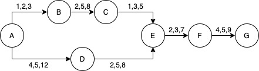
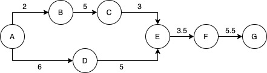
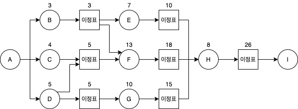
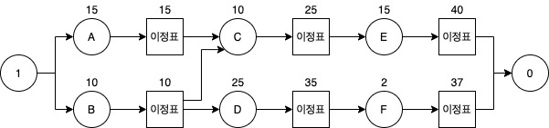
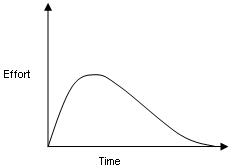
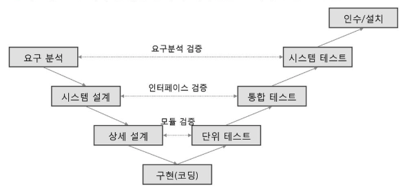

# 소프트웨어의 종류 및 개발 방법론

## 소프트웨어 분류 및 특성

### 상용 소프트웨어

#### 상용 소프트웨어의 구분

<table>
  <tr>
    <th colspan="4"> 상용 소프트웨어 </th>
  </tr>
  <tr>
    <td colspan="3">산업 범용 S/W</td>
    <td>산업 특화 S/W</td>
  </tr>
  <tr>
    <td>시스템 S/W</td>
    <td>미들웨어</td>
    <td>응용 S/W</td>
    <td>자동차 등 13개</td>
  </tr>
</table>

### 시스템

> 하나의 공통저인 목적을 가지고 있는 구성요소들을 상호 결합해 놓은 유기적인 집합체

#### 시스템의 기본 요소

- 입력
- 출력
- 처리
- 피드백

#### 시스템 소프트웨어

> 응용 프로그램을 실행하기 위한 환경을 제공하고 컴퓨터 하드웨어를 동작/관리하는 소프트웨어.

### 플랫폼

> 응용 프로그램을 실행하기 위해 사용하는 하드웨어와 소프트웨어의 결합

#### 플랫폼의 기능

- 소프트웨어 개발/운영비용 절약
- 동일 플랫폼 간 공통 그룹 형성 - 네트워크 효과 최대화
- 개발의 생산성 향상

#### 플랫폼의 성능 특성 분석 항목

- 가용성(Avaliability)
- 응답 시간(Response Time)
- 정확성(Accuracy)
- 사용률(Utilization)

### 프레임워크

> '일정하게 짜여진 틀에서 일한다'의 의미

#### 소프트웨어 프레임워크의 특징

- 모듈화(Modularity)
- 재사용성(Reusability)
- 확장성(Extensibility)
- 제어의 역 흐름(Invesion of Control): 다형성을 통해 제어가 프레임워크부터 애플리케이션으롤 거꾸로 흐르게 한다

#### 프레임워크를 적용할 경우 기대효과

- 개발 용이성
- 품질 보증
- 변경 용이성
- 유지보수 용이성
- 재사용성 향상
- 표준화율 향상
- 상호 운용성 향상

### 기업용 소프트웨어

- 오피스웨어: 회사나 단체에서 사용하는 소프트웨어
- ERP: 신속한 의사 결정을 위한 소프트웨어
- SCM: 부품 공급자를 지원하는 소프트웨어
- BI: 구성원에게 적시에 의사 결정을 지원하는 소프트웨어
- CRM: 고객 특성에 기초한 마케팅 활동을 지원하는 소프트웨어

### 컴포넌트

> 부품화 된 프로그램을 모듈, 모듈들의 집합을 라이브러리, 라이브러리의 집단을 컴포넌트라고 한다.

#### 컴포넌트 설계의 조건

- 컴포넌트의 오퍼레이션 사용 전에 참이 되어야 할 선행 조건
- 오퍼레이션이 실행되는 동안 항상 만족되어야 할 불변 조건
- 사용 후 만족되어야 할 결과 조건

#### CBD

> 재사용이 가능한 컴포넌트 기반의 개발 방법론. 개발 기간 단축, 유지보수 비용 최소화가 가능해 시스템을 신속하게 구축, 기능 추가/확장이 용이

### 소프트웨어 공학

> 최소의 비용으로 높은 품질의 소프트웨어를 개발하기 방법론, 소프트위기를 극복, 품질/생산성 향상을 목적으로 연구하는 학문

#### 소프트웨어 공학의 기본 원칙

- 현대적인 프로그래밍 기술을 적용한다.
- 지속적인 검증을 시행한다.
- 결과에 관한 명확한 기록을 유지한다.
- 품질 높은 소프트웨어 상품을 개발한다.

#### 소프트웨어 공학의 도입

> 소프트웨어 개발 과정에 공학적인 접근을 시도하여 생산성과 신뢰성을 높이기 위한 기법과 원리를 다루기 위해 도입

- 방법(Method)
- 도구(Tool)
- 절차(Procedure)

---

## 소프트웨어 개발 방법론

### `소프트웨어 개발 환경`

### 운영체제

> 하드웨어와 소프트웨어 자원을 관리하고 컴퓨터 프로그램을 위한 공통 서비스를 제공

#### 운영체제 분석 시 고려사항

- 신뢰도
- 성능
- 기술 지원
- 주변 기기
- 구축 비용

#### 운영체제 현황

- CISC 방식이 적용된 인텔 x86 칩을 사용하는 하드웨어는 Windows나 Linux를 설치할 수 있다
- RISC 설계 방식이 적용된 칩들은 UNIX 운영체제를 설치
- HP/Intel이 협력하여 만든 IA-64 칩은 여러 운영체제를 지원
- RISC 설계 ARM 칩은 사므트포니나 태블릿에 주로 채택

### CPU

#### CISC 설계 방식

- 복잡하고 많은 종류의 명령어와 주소 지정 모드 사용
- 가변 길이 명령어 형식
- 설계가 어렵다
- 마이크로 프로그래밍 제어 방식
- 호환성이 좋다
- 명령어를 해석한 후 명령어 실행
- 속도가 느리다

#### RISC 설계 방식

- 간단하고 적은 종류의 명령어와 적은 수의 주소 지정 모드 사용
- 고정 길이 명령어 형식
- 명령어 수가 적다
- 하드웨어적 제어 방식
- 효율적인 파이프라이닝 구조
- 해석속도 빠름
- 많은 수의 범용 레지스터 사용
- 처리속도가 빠르고 하드웨어 구조 간단
- 효율성이 떨어지고 전력 소모가 적다
- 처리비트 단위가 변하거나 프로세서 구조가 조금만 바뀌어도 하위 프로세서와 호환성이 떨어짐

### DBMS

> 대량의 데이터를 저장하고 있는 데이터베이스를 생성, 조회, 변경 등 관리하는 프로그램

#### DBMS의 종류

- Oracle: 대규모, 안정적
- IBM DB2: 대규모, 안정적
- SQL Server: 중소규모, 안정적
- MySQL: 오픈소스
- SQLite: 스마트폰, 태블릿 등 Embbed
- MongoDB: 오픈소스, NoSQL
- Redis: 오픈소스, Key-Value

#### DBMS 분석 시 고려사항

- 가용성
- 성능
- 기술 지원
- 상호 호환성
- 구축 비용

### 미들웨어

> 소프트웨어 애플리케이션에게 운영체제가 제공하는 서비스를 추가 및 확장하여 제공하는 소프트웨어

> 클라이언트-서버 간 통신을 담당하는 시스템 소프트웨어

#### 미들웨어의 종류

- DBMS
- RPC: 원격 프로시저를 마치 로컬 프로지서처럼 호출하는 미들웨어
- MOM: 비동기형 메시지를 전달하는 방식의 미들웨어. 이 기종 분산 데이터 시스템의 데이터 동기를 위해 많이 사용
- TP-Monitor: 정상적인 트랜잭션 처리 확인을 위해 데이터를 감시/제어하는 프로그램
- ORB: 객체지향 미들웨어로 코바(CORBA) 표준 스펙을 구현한 미들웨어
- WAS: 웹 환경을 구현하기 위한 미들웨어

### WAS

- 웹 개발을 지원하기 위해 설계된 소프트웨어로, 데이터 접근 관리, 트랜잭션 관리 등을 위한 라이브러리 제공.
- WAS는 HTTP 세션 처리를 위한 웹 서버 기능 뿐만 아니라 필수적인 기업 업무까지 Java, EJB 컴포넌트 기반으로 구현이 가능
- 정적 데이터(이미지, js코드 등)는 웹 서버가 직접 처리
- 동적 데이터(DB 접속, 외부 시스템 연동 등)는 WAS의 지원을 바다 처리

#### WAS의 종류

- Jetty: Eclipse에서 제공, 빠른 처리 속도
- JEUS: TmaxSoft에서 제공, 대량의 안정적인 처리, 적시의 기술 지원
- Resin: Caucho Technology에서 제공, 빠른 처리 속도
- WebLogic: Oracle Corporation에서 제공, 대량의 안정적인 처리
- WebSphere: IBM에서 제공, 대량의 안정적인 처리

#### WAS 분석 시 고려사항

- 가용성
- 성능
- 기술 지원
- 구축 비용

### 오픈소스

> 소스 코드 공개를 통해 누구나 특별한 제한 없이 그 코드를 보고 사용할 수 있는 오픈소스 라이선스를 만족하는 소프트웨어

#### 오픈소스 분석 시 고려사항

- 라이선스 종류, 사용자 수, 기술의 지속 가능성 고려

### `소프트웨어 개발 방법론`

### 구조적 방법론 - 1970년대

#### 절차

타당성 검토 -> 계획 -> 요구사항 -> 설계 -> 구현 -> 시험 -> 운용/유지보수

#### 구조적 방법론의 특징

- 1970년대까지 가장 많이 적용되었던 개발 방법론
- 구조화 프로그래밍/구조적인 프로그램 작성
- 정형화된 분석 절차, 요구사항을 파악하여 문서화하는 체계적 분석 방법
- 쉽게 이해/검증 할 수 있는 프로그램 코드 생성이 목표
- 모듈 중심 개발
- 분할과 정복, 하향식 기능 분해
- 프로세스 중심 방식의 개발에 유용
- 재사용성, 유지보수성 낮다

### 정보공학 방법론 - 1980년대

#### 절차

- 수직적 구조 방법론: 정보전략 계획 -> 업무영역 분석 -> 업무시스템 설계 -> 기술 설계 -> 업무 시스템 구축 -> 업무 시스템 실행
- 수평적 구조 방법론: 데이터 -> 업무활동 -> 상호작용

#### 정보공학 방법론의 특징

- 정보 시스템 개발에 필요한 관리 절촤와 작업 기법을 체계화
- 소프트웨어 공학의 기술 발전에 따라 활용하기 위한 개발 방법론
- 새명주기를 이용해 대형 프로젝트를 수행하는 체계적인 방법론
- 시스템의 계획, 분석, 설계 및 구축을 하는 데이터 중심의 방법론
- 자료구조 중심의 방법론
- 데이터와 프로세스가 균형적
- 기능적 설계를 못 벗어남
- 기능별로 유지보수, 재사용성 낮다.

### 객체지향 방법론 - 1990년대

#### 절차

요구분석 -> 설계 -> 구현 -> 시험 -> 인수

#### 객체지향 방법론의 특징

- 데이터와 그 데이터에 관련된 동작을 모두 포함하는 방법론
- 데이터: 실체, 동작: 절차, 방법, 기능
- 정보 시스템과 데이터베이스를 설계
- 객체지향 기법을 활용하여 시스템을 구축하고자 하는 방법론
- 캡슐화, 추상화 기술 필요
- 분석 초점 명확
- 자연스럽고 유연, 재사용 용이
- 전문가 부족

### 컴포넌트 기반 방법론 -2000년대

#### 절차

개발 준비 -> 분석 -> 설계 -> 구현 -> 시험 -> 전개 -> 인도

#### 컴포넌트 기반 방법론의 특징

- 컴포넌트를 조립해서 하나의 새로운 애플리케이션을 작성하는 방법론
- 모듈은 기능을 구현하기 위한 최소 단위
- 공공 행정 정보 시스템의 개발에 많이 활용되고 있는 표준 프로세스
- 생산성/품질 증가, 유지보수 비용 최소화
- 반복적, 점진적 개발
- 재사용성, 생산성, 품질이 높은 방법론
- 비용 저렴, 위험 개선
- 소프트웨어 위기를 극복하기 위한 방법론
- 컴포넌트 유통 환경 개선해야 함
- 테스트 환경 부족, 컴포넌트 평가/인증 환경 미흡

#### 소프트웨어의 위기

- 개발 비용이 계속적으로 증가
- 유지보수 비용 증가
- 과거에는 기술적 측면 강조, 현재에는 관리적인 면 강조
- 잦은 요구변화, 개발기간 연장
- 하드웨어 기술은 높지만 소프트웨어 기술은 낮다
- 업무 전문성 증가, 개발자와 사용자 간 의견차이 크다
- 기능적 오류 많아져 성능/신뢰성 부족
- 품질 평가 기준 없음
- 시장은 넓지만 개발 인력은 부족

### 애자일 방법론 - 2000년 이후

#### 등장 배경

- 사용자의 요구사항이 빈번하게 변경, 새로운 방법론이 필요
- 계획이 없는 개발의 경우 선행 작업 예측이 힘들고 비효율적
- 계획이 지나친 개발의 경우, 형식적 절차에 의한 비용과 개발 흐름 자체가 느리다는 단점 보유

#### 애자일 방법론의 정의

- 요구사항, 설계, 구현, 시험의 단계를 통해 개발하는 방법론
- 무계획/지나친 계획 사이에 타협점을 찾은 방법론
- 요구사항을 지속적으로 분석/반영하여 시간지연을 최소화

#### 애자일 방법론의 특징

- 프로세스/도구 중심이 아닌 개발 과정의 소통을 중요시 생각
- 반복적인 개발을 통한 잦은 출시가 목표
- 기존 모형(폭포수/프로토타입/나선형)의 문제점 보완
- 점증적 개발
- 짧은 출시 주기, 다양한 요구 변화에 대응
- 고객/개발팀의 소통, 개발팀원간 소통, 협력 극대화
- 인간의 수행 능력을 높이기 위한 현실적인 방법 제시
- 가볍고 실용적
- 소프트웨어 개발 방법론의 방법론

#### 애자일 방법론 선언문 (2001년)

- 개인과 상호 작용을 프로세스와 도구보다 중시한다
- 동작하는 소프트웨어를 포괄적인 문서보다 중시한다
- 고객과의 협력을 계약의 협상보다 중시한다
- 변화의 대응을 계획의 수행보다 중시한다

#### 애자일 방법론의 원칙

1. 소통한다
2. 협력한다
3. 적응한다
4. 지속한다
5. 가치를 전달한다
6. 피드백 한다

#### 애자일 방법론의 5가지 가치

- 의사소통
- 용기
- 피드백
- 단순함
- 존경

#### 익스트림 프로그래밍

- 애자일 모형으로 소프트웨어를 개발하는 대표적 방법
- 문서화를 강조하지 않고 변경을 추구, 개발 초기부터 검사를 병행할 것을 강력히 권고
- 의사소통 개선, 즉각적인 피드백, 단순한 코딩으로 소프트웨어 품질을 높이는 방법
- 애자일 방법론의 5가지 가치를 실현한 방법론

#### 스크럼

- 애자일 방법론 중 하나, 프로젝트 관리를 위한 상호 점진적 개발 방법론
- 매일 정해진 시간, 정해진 장소에서 단기간에 개발하는 개발티믈 위한 프로그램 관리 중심의 방법론
- 유지보수팀, 일반적인 프로젝트 관리에서도 적용 가능
- 추정 및 조정 기반의 경험적 관리 기법

#### 스크럼의 5가지 가치

- 확약
- 전념
- 정직
- 존중
- 용기

#### 스크럼의 요소

- 백로그: 프로젝트에 대한 요구사항
- 스프린트: 30일 단위로 분리하여 반복적 수행
- 스크림 미팅: 5분정도의 팀 미팅, 작업의 계획 수립
- 스크림 마스터: 팀 리더

### 린

- 린 시스템의 품질 기법을 적용, 개발 프로세스의 낭비적인 부분을 제거한 방법ㄹ노
- 개발결과를 측정, 성과를 분석하여 품질 향상

#### 린 방법론의 7가지 원칙

- 낭비적인 요소 제거
- 품질 내재화
- 지식 창출
- 가능한 늦게 결정
- 가능한 빠르게 인도
- 사람을 존중
- 전체공정 최적화

### 제품 계열 방법론 - 2010년대

- 특정 제품에 적용하고 싶은 공통된 기능 정의/개발
- 임베디드 소프트웨어 작성에 유용
- 영역 공학과 응용 공학을 연계시키기 위한 제품의 요구사항/아키텍쳐/조립 생산이 필요

### 테일러링 개발 방법론

- 다양한 종류의 프로젝트를 일관된 개발 방법론으로 적용하기 어렵기 때문에 등장한 방법론
- 소프트웨어 특성에 맞게 융토성 있게 적용
- 표준 프레임워크를 기반으로 업무 분야별로 여건에 맞게 수정보완
- 방법론에는 표준이 없다
- 일반적으로 따르는 절차들과 개별 방법론에서 제시하는 테일러링 안내서 존재
- 커스터마이징의 작업이 반복
- 프로젝트 분석이 가장 중요
- 테일러링을 위한 개발 프레임워크: ISO/IEC 12207, CMMI 모델, SPICE 등

#### 테일러링 개발 방법론의 필요성

- 내부 기준
  - 목표환경
  - 요구 사항
  - 프로젝트 규모
  - 기술 환경
- 외부 기준
  - 법적 제약 사항
  - 표준 품질 기준

### 보안 개발 방법론

- MS-SDL: 안전한 소프트웨어 개발을 위해 MS에서 자체적으로 수립한 SDLC
- Seven Touchpoints: 실무적으로 검증됨. S/W 보안 모범사례를 SDLC에 통합한 S/W 개발 보안 생명 주기 방법론
- CLASP
  - 소프트웨어 개발 생명주기 초기 단계에ㅓ 보안을 강화하기 위한 정형화된 프로세스
  - 활동중심 역할 기반의 프로세스로 구성된 집합체
  - 이미 운영중인 시스템에 적용하기 적합
  - 개념, 역할기반, 활동 평가, 활동 구현 취약성의 5가지 관점에 따라 개발 보안 프로세스를 수행할 것을 제안
- CWE
  - 소프트웨어의 보안 취약점을 유발하는 원인을 7가지로 정리한 방법론
  - 7가지 원인: 입력데이터 검증 표현, 보안기능, 시간 및 상태, 오류처리, 코드품질, 캡슐화, API 악용

## 프로젝트 관리 및 생명주기 모형

### 프로젝트 관리

- 사업의 목적에 맞게 미리 계획된 일정과 금액 범위에서 정해진 목적을 달성하기 위한 모든 활동
- 프로젝트는 시간이 정해져 있고, 업무마다 개발 방법이 다르며, 단계적으로 진행됨

#### 프로젝트 관리의 분류

- 일정 관리
- 예산 관리
- 인력 관리
- 위험 관리
- 품질 관리

#### 프로젝트 관리의 3P

- 사람(People)
- 문제(Problem)
- 프로세스(Process)

#### 프로젝트 계획 수립

1. 범위, 자원, 비용 측정을 통해 위험성 최소화
2. 소프트웨어 범위 측정
   - 처리기능
   - 성능
   - 제한조건
   - 개발인원
   - 일정계획
3. 자원 측정
   - 하드웨어 자원: 개발자/목표/개발지원 시스템
   - 소프트웨어 자원
   - 인적 자원

#### 개발자팀 구성

- 책임 프로그래머팀: 1인의 책임 프로그래머 독재체제, 다른 팀원들은 책임 프로그래머를 보조
- 민주주의식팀: 다수 책임 체제, 개개인의 담당 분야가 각각 존재
- 혼합형팀

### 일정 계획 방법론

#### PERT 네트워크

- 프로그램 평가 및 검토 기술
- 소요기간의 예측이 어려운 경우에 유리
- 작업별로 낙관치(최저), 기대치(평균), 비관치(최대)를 나누어 종료시기 결정
- 예측치 공식을 이용하여 소요기간 설정

#### PERT를 이용한 일정 계획 순서

1. 소프트웨어 전체 규모 추정
2. 작업을 기능별/특징별 분류
3. 단계별로 작업 일정 예측

#### PERT 일정 계획

- 작업별로 낙관치, 기대치, 비관치를 간선에 표시
- 예측치 공식을 사용하여 예측치를 구한다
- 예측치 = $\frac{낙관치+(4\times 기대치)+비관치}{6}$

| 일정 | 낙관치 | 기대치 | 비관치 | 예측치 |
| ---- | ------ | ------ | ------ | ------ |
| A->B | 1      | 2      | 3      | 2      |
| B->C | 2      | 5      | 8      | 5      |
| C->E | 1      | 3      | 5      | 3      |
| A->D | 4      | 5      | 12     | 6      |
| D->E | 2      | 5      | 8      | 5      |
| E->F | 2      | 3      | 7      | 3.5    |
| F->G | 4      | 5      | 9      | 5.5    |

- A 작업에서 E 작업으로 넘어가기 위해서는 A->B->C->E(10일 소요)와 A->D->E(11일 소요)를 거쳐야 하므로 11일이 걸린다.
- 일정이 가장 늦은 경로인 임계경로는 A->D->E->F->G이다

#### CPM 네트워크

- 임계경로 기법이라고도 함
- 소요시간이 확실한 경우 유리
- 노드에는 작업명, 간선은 작어바이의 전후 의존 관계를 표시
- 원형 노드와 박스 노드로 구분
- 원형 노드에는 작업명과 해당 작업의 소요시간, 박스 노드는 이정표와 예상 완료 시간을 표시
- 한 이정표에서 다른 이정표로 도달하기 전에 작업을 완료해야 함

#### CPM을 이용한 일정 계획 순서

1. 소프트웨어 전체 규모 추정
2. 작업을 기능별/특징별로 분류
3. 단계별 상호 의존 관계를 CPM 네트워크로 도식
4. 간트 차트 작성

#### CPM 일정 계획

- A: 시작작업, I: 종료작업
- B 작업은 3일, C 작업은 4일, D 작업은 5일 소요됨
- F 작업이 진행되려면 B, C, D 작업이 종료되어야 함
- H 작업이 착수되려면 F 작업을 끝마친 18일 후에나 H 작업이 진행됨
- 일정이 가장 늦은 경로인 임계경로는 A->D->F->H->I이다

- C 작업에서 빠른 착수일은 A, B 작업이 모두 끝난 15일이다
- C 작업에서 늦은 착수일은 총 작업기간에서 C, E의 소요 기간을 뺀 15일이다
- C 작업의 빠른 착수일과 늦은 착수일이 같으므로 C 작업은 임계 경로에 있다
- F 작업은 E 작업이 완료될 때까지 3일간의 여유 기간이 있다

#### PERT와 CPM에서 제공되는 항목

- 프로젝트 개발 기간을 결정하는 임계경로
- 통계적 모델 적용, 개별 작업의 가장 근접한 시간 측정
- 단계별 작업에 대한 시작시간 정의, 작업 간 경계 시간 계산 가능
- 일정 계획과 비용측정을 절대 같이 하지 않는다

#### 위험관리

> 프로젝트 추진 과정에서 예상되는 각종 돌발 상황에 대한 적절한 대책을 수립하는 일련의 활동

#### 위험관리 순서

1. 위험 식별
2. 위험 분석 및 평가
3. 위험 관리 계획
4. 위험 감시 및 조치

#### 위험 모니터링

> 위험 요소 징후들에 대해 계속적으로 인지하는 것

#### 위험표

| 위험의 내용  | 위험의 종류  | 위험 발생 확률 | 영향력 | 대안       |
| ------------ | ------------ | -------------- | ------ | ---------- |
| 비용측정실패 | 비즈니스위험 | 5%             | 매우   | 손해감수   |
| 일정계획실패 | 프로젝트위험 | 40%            | 보통   | 기간연장   |
| 기술부족     | 기술적인위험 | 70%            | 보통   | 개발자섭외 |
| 인력부족     | 프로젝트위험 | 75%            | 보통   | 추가증원   |

### 비용 측정

#### 비용측정요소

1. 직접 측정 요소
   - 수치, 양, 크기처럼 직접적으로 측정이 가능한 요소
   - 노력(인월), 비용, 라인 수(LOC), 오류 수, 투입 인원, 처리 속도, 문서 수 등
2. 간접 측정 요소
   - 비교 대상이 있어야 측정 가능한 요소
   - 생산성, 품질, 기능점수(FP), 문서화 비율, 효율성, 신뢰도, 유지보수성 등

#### 인월

- 한 사람이 1개월동안 작업할 양
- 24인월 = 1명이 24개월 동안 작업할 양, 24명이 1개월에 작업할 양
- 비용 측정 단위로 가장 많이 사용됨

#### 비용 측정의 원칙

1. 비용 측정을 최대한 지연시킨다
   - 비용측정의 실패 = 프로젝트 전체의 실패
   - 비용측정을 최대한 늦춰서 실패 위험을 줄임
2. 분해기술 이용
   - 소프트웨어를 기능별로 분리한 뒤 모아서 전체 비용을 측정
3. 실험적 비용 측정 모델 이용
   - 이미 개발되었던 소프트웨어 비용을 참고로 하여 측정
4. 자동화 도구 이용
   - SLIM과 같은 비용 측정 프로그램 이용

#### 개발 비용과 개발 기간의 상관관계

> 개발 기간이 짧아질수록 개발 비용은 증가하고, 개발 기간이 증가하면 개발 비용이 감소

#### 간접 측정 평가 공식

> 생산성 = LOC / 인월  
>  개발기간 = 인월 / 개발인원  
>  개발기용 = 인월 \* 단위비용

#### 비용 측정 방법론의 분류

<table>
  <tr>
    <th colspan="2">하향식</th>
    <th colspan="7">상향식</th>
  </tr>
  <tr>
    <td>전문가 측정</td>
    <td>델파이식 측정</td>
    <td>LOC 측정</td>
    <td>단계별 인월</td>
    <td colspan="5">수학적 산정</td>
  </tr>
  <tr>
    <td colspan="4"></td>
    <td>Walston 모형</td>
    <td>COCOMO 모형</td>
    <td>Putnam 모형</td>
    <td>기능 점수 모형</td>
    <td>간이 기능 점수</td>
  </tr>
</table>

1. 하향식: 전체 비용 측정 -> 기능/단계별 비용으로 분리
2. 상향식: 기능/단계별 비용 측정 -> 전체 비용 측정

#### 전문가 측정

- 개발비용 측정 전문가에게 의뢰
- 신속하게 비용 결정
- 전문가의 편견이 문제가 될 수 있음

#### 델파이 측정

1. 중재자는 여러 전문가에게 소프트웨어에 대해 설명
2. 전문가들은 측정한 비용을 제출
3. 중재자는 전문가들의 측정 결과를 익명으로 제공
4. 2, 3을 반복하면서 평균치의 비용을 최종 비용으로 결정

#### LOC 측정

- 소프트웨어를 기능별로 세분화
- 입력/처리/출력기능으로 세분화한 기능의 라인 수 예측
- 프로그램 개발 경험자들이 예측한 라인 수를 낙관치(최소)/기대치(평균)/비관치(최대)로 측정
- 측정된 라인 수를 공식(예측치 = $\frac{낙관치+(4\times 기대치)+비관치}{6}$)에 적용, 예측치 계산
- 예측치를 통해 라인당 비용 측정 혹은 경험적인 방법으로 예측치의 인월을 산출

#### 단계별 인월

- LOC 측정의 단점을 보완
- LOC 측정은 라인수로만 측정, 단계별 중요도 무시
- 단계별 중요도를 인월로 가중치를 부여 후 측정

#### Walston 측정

- 미국의 60개 개발업체에서 이미 개발한 소프트웨어의 자료를 수집, 다음과 같은 통계적 공식을 만듦

> MM(인월) = $5.2\times[KDSI]^{0.91}$  
> $TDEV(개발기간) = 2.47\times[MM]^{0.35}$

- KDSI는 KLOC(전체라인수)에서 공백라인, 주석, 라이브러리 등을 제외한 실제 수행 명령어 라인 수
- Walston 공식은 소프트웨어 규모/난이도에 상관없이 적용하기 때문에 오류 많음
- Walston 공식의 단점을 보완하여 COCOMO 단체에서는 소프트웨어의 규모와 난이도를 고려하여 3가지 형태로 분류함

#### COCOMO 모형

1. 유기형: 기관내부의 중소규모 소프트웨어, 일괄처리/과학기술계산/비즈니스자료처리용 5만라인이하의 소프트웨어

   > $MM = 2.4\times[KDSI]^{1.05}$  
   > $TDEV=2.5\times[MM]^{0.38}$

2. 준 분리형: 트랜잭션 처리 시스템, 운영체제, 데이터베이스 고나리 시스템 등 30만 라인 이하의 소프트웨어

   > $MM = 3.0\times[KDSI]^{1.12}$  
   > $TDEV=2.5\times[MM]^{0.35}$

3. 내재형: 최대형 규모의 트랜잭션 시스템, 운영체제 등 소프트웨어
   > $MM = 3.6\times[KDSI]^{1.20}$  
   > $TDEV=2.5\times[MM]^{0.32}$

#### Putnam 모형

- 대형 프로젝트에서 이용되는 기법
- 시간에 따른 함수로 표현되는 Rayleigh-Norden 곡선의 노력 분포도 곡선으로 그려짐
- 
- 개발 기간이 연장될수록 프로젝트 적용 인원의 노력이 감소, 대형 프로젝트의 노력 분포 산정에 용이
- SLIM은 Putnam 모형을 기초로 만든 자동화 추정 도구
- SLIM은 총인월(MM), 개발기간 등 비용 측정값을 입력하면 소프트웨어 비요 산출을 자동으로 출력해줌

#### Putnam 모형 공식

> $MM=\frac{LOC^3}{[개발기술지수]^3\times[개발기간]^4}$  
> $LOC=[개발기술지수]\times[MM]^{\frac{1}{3}}\times[개발기간]^{\frac{4}{3}}$

- 개발기술지수는 임의로 부여할 수 있는 값으로 예를 들면, 최악환경은 12000, 보통환경은 8000, 최상환경은 5000 정도로 적용

#### 기능 점수 모형

1. 기능 점수 모형의 개념
   - 기능점수는 논리적 설계 관점에서 사용자가 요구하고 인도받는 기능량을 정량적으로 산정하는 방식의 소프트웨어 기능 규모 산정 방법
   - 기능점수는 소프트웨어의 양과 질을 동시에 고려한 소프트웨어 규모 산정 방식의 일종, 정보처리 규모와 기능적 복잡도에 의해 소프트웨어 규모를 사용자의 관점에서 기술적 요소는 배제하고 측정하는 방식
   - 물리적인 파일/테이블/프로그램 모듈 수 산정하지 않음
   - 산정 기준이 규칙으로 정의되어 있어 결과의 일관성과 정확성 확보
   - 국제 표준 소프트웨어 규모 산정 방법
2. 기능 점수 모형과 LOC 측정의 비교

| 구분         | 기능점수                | LOC측정            |
| ------------ | ----------------------- | ------------------ |
| 적용시점     | 전체생명주기            | 구현이후           |
| 고객과의소통 | 좋음                    | 나쁨               |
| 관점         | 고객관점, 논리적        | 개발자관점, 물리적 |
| 표준         | 국제표준(ISO/IEC 14143) | 없음               |

3. 기능 점수의 비용 산정 요소
   - 입력 유형의 수
   - 출력 유형의 수
   - 사용자 명령어 수
   - 데이터파일 수
   - 인터페이스 수

### 형상 관리

#### 형상 관리의 역할 및 특성

- 리버전이나, 버전 정보에 대해 접근이 가능, 배포본 관리에 유용
- 불필요한 사용자 소스의 수정을 제한
- 동일한 프로젝트에 대해 여러 개발자가 동시에 개발 가능

#### 형상 관리 절차

1. 형상 식별
   - 형상 관리 대상을 식별, 이름과 관리번호 부여, 계층 구조로 구분
   - 수정 및 추적이 용이하도록 하는 작업, 베이스라인의 기준을 정하는 활동
   - 형상관리항목
     - 소프트웨어 공학 기반 표준과 절차
     - 프로젝트 계획서
     - 요구사항 명세서
     - 아키텍처, 실행가능한 프로토타입
     - 화면, 프로그램 설계서
     - 데이터베이스 기술서
     - 소스코드 목록, 소스코드
     - 실행 프로그램
     - 테스트 계획/절차/결과
     - 설치/사용/운영에 필요한 메뉴얼
     - 유지보수 문서
     - 개발비용은 절대 형상 관리 항목이 될 수 없음
2. 변경 제어
   - 식별된 형상 항목의 변경 요구를 검토, 승인하여 적절히 통제, 현재의 베이스라인에 잘 반영될 수 있도록 조정
   - 적절한 형상 통제가 이루어지기 위해 형상통제위원회 승인을 통한 통제가 이루어질 수 있어야 함
3. 형상 상태 보고
   - 베이스라인의 현재 상태 및 변경 항목들이 제대로 반영되는지 여부를 보고하는 절차
   - 형상의 식별, 통제, 감사 작업의 결과를 기록 및 관리, 보고서를 작성하는 작업
4. 형상 감사
   - 베이스라인의 무결성을 평가하기 위해 확인, 검증 과정을 통해 공식적으로 승인하는 작업

### 소프트웨어 개발의 생명주기 모형

#### 폭포수 모형

1. 타당성 검토
2. 계획
3. 요구분석
4. 설계
5. 구현
6. 검사
7. 운용 + 유지보수

- 각 단계를 명확히 하고 다음 단계로 넘어감
- 이전 단계로 되돌아 갈 수 없음
- 적용 경험과 성공 사례가 많다
- 오래되고 널리 사용된 전통적인 기법
- 단계별로 문서화 작업 필요
- 항공방위 소프트웨어 시스템 개발 경험을 토대로 처음 개발, 1970년대부터 널리 알려짐

#### 프로토타입 모형

1. 요구수집
2. 빠른설계
3. 프로토타입 구축
4. 고객평가
5. 프로토타입 조정: 다시 요구수집 단계로 가서, 모든 단계를 사용자가 만족하는 수준까지 반복

- 요구사항 변경 용이
- 요구사항이 불명확한 경우 유리
- 공동의 참조 모델 제공
- 단기간 개발하기 때문에 비효율적인 알고리즘, 언어 사용 가능

#### 나선형 모형

1. 계획 수립
2. 위험분석
3. 개발 및 검증
4. 고객평가

- 모든 단계를 반복하면서 개발
- 프로토타입을 지속적으로 발전시켜 최종 소프트웨어 개발
- 위험 관리가 중심인 소프트웨어 생명주기 모형
- 폭포수 모형과 프로토타입 모형의 장점을 살린 모형
- 대규모 시스템의 소프트웨어 개발에 적합

#### V 모형

- 검증을 강조한 기법
- 폭포수 모형의 변형, 오류 발생 시 왼쪽의 단계로 되돌아갈 수 있음
- 산출물보다는 각 개발 단계의 테스트에 중점
- 높은 신뢰성을 필요로 하는 의료 제어 시스템, 원자력 발전소 제어 시스템 등의 개발에 적합

#### 4세대 모형

- 4세대 언어를 이용한 기법
- 자연 언어와 가까운 수준에서 개발 가능
- 설계 단계를 축소, 요구분석 단계에서 구현 단계로 직접 전환 가능
- 대규모 프로젝트에서는 오히려 분석, 설계, 검사 단계에서 많은 시간이 필요하므로 개발 시간이 오래 걸림

### 테일러링을 위한 품질 관리

#### ISO 12207 표준

- 소프트웨어 개발 프로세스를 정의하고 향상시키기 위한 프로세스
- 기본공정, 지원공정, 조직공정으로 구성
- 기본공정: 공급, 획득, 개발, 운영, 유지보수
- 지원공정: 문서화, 형상관리, 문제해결, 품질보증, 검증, 확인, 합동검토, 감리
- 조직공정: 관리, 기반구조, 개선, 교육훈련
- 소프트웨어와 관린된 조직/이해관계자들이 각자의 입장에서 수행해야 할 일을 정의하고 지속적으로 개선시키기 위한 활동

#### ISO/IEC

- ISO/IEC 9126: 소프트웨어 품질 특성과 척도에 관한 표준 지침서
- ISO/IEC 12119: 패키지 소프트웨어으이 일반적인 제품 품질 요구사항 및 테스트를 위한 국제 표준
- ISO/IEC 12509: OSI 7계층에 관리 기능에 대한 공통된 정보를 명세화하는 규격 (폐지)
- ISO/IEC 29119: 소프트웨어 테스트 관련 국제 표준

#### ISO/IEC 품질 특성

- 기능성(Functionality)
  - 적합성(Suitability)
  - 정확성(Accuracy)
  - 상호 운용성(Interperability)
  - 보안성(Security)
  - 준수성(Compliance)
- 신뢰성(Reliability)
  - 성숙성(Maturity)
  - 결함허용성(Fault Tolerance)
  - 복구성(Recoverability)
- 사용성(Usablity)
  - 이해성(Understandability)
  - 학습성(Learnability)
  - 운영성(Operability)
  - 선호도(Attractiveness)
  - 준수성(Compliance)
- 효율성(Efficiency)
  - 시간 반응성(Time Behaviour)
  - 자원활용성(Resource Utilzation)
  - 준수성(Compliance)
- 유지보수성(Maintainability)
  - 분석성(Analyzability)
    - qusrudtjd(Changability)
    - 안정성(Stability)
    - 시험성(Testability)
    - 준수성(Compliance)
  - 이식성(Portability)
    - 적응성(Adaptability)
    - 설치성(Installability)
    - 공존성(Co-existence)
    - 대체성(Replaceability)
    - 준수성(Compliance)

#### CMM

- 소프트웨어 개발과 유지보수에 대한 프로세스 개선과 능력 향상을 위한 프레임워크, 실용화된 모델
- 소프투에어 프로세스의 신뢰적이고 이로간성 있는 능력평가기반구조
- 소프트웨어 개발과 유지보수 능력의 증대 요인들을 준수
- 소프트웨어 개발 조직의 프로세스 성숙도 개선 및 측정을 위해 정부/산업계에서 사용
- 조직, 작업순서, 관리방법, 기법, 도구, 환경 등을 프로세스의 요소로 저으이
- 레벨이 높을수록 소프트웨어 개발 프로세스의 품질이 좋아짐
- 프로세스를 평가하고 개선하기 위해서는 프로세스가 가지는 기술적, 인간적 측면을 모두 고려

#### CMM의 5가지 성숙 단계와 핵심 프로세스

| 성숙단계              | 저으이                                                                         | 핵심프로세스                                                                                                |
| --------------------- | ------------------------------------------------------------------------------ | ----------------------------------------------------------------------------------------------------------- |
| 초기단계(Initial)     | - 소프트웨어 개발 관리 부재 - 프로세스 성과를 예측 불가                     | 없음                                                                                                        |
| 반복단계(Repeatable)  | - 성공 프로젝트 반복 사용 - 통계적 관리가 가능                              | 요구관리, 계획, 추적, 감시, 형상관리, 품질보증                                                              |
| 정의단계(Defined)     | - 프로세스 작업 정의와 이해 가능 -데이터로 프로젝트 관리 - 발전되는 상태 | 조직 프로세스 관리, 교육 훈련 프로그램, 통합 소프트웨어 관리, 생산 공학, 동료 검토, 그룹 간 조정, 중간 심사 |
| 관리단계(Managed)     | - 프로세스 성과 측정, 분석 기능 - 프로세스 성과 개선, 관리 기능             | 정량적 프로세스 관리, 소프트웨어 품질 관리                                                                  |
| 최적 단계(Optimizing) | 질적, 양적 개선이 지속적인 상태                                                | 결함 예방, 기술변화 관리, 프로세스 변경 관리                                                                |

#### CMM 모델 프로세스 평가 기준

| Level   | 관리명칭    | 주요내용                       | 평가         |
| ------- | ----------- | ------------------------------ | ------------ |
| Level 1 | 혼돈적 관리 | 순서의 일관성이 없음           | 위험성       |
| Level 2 | 경험적 관리 | 일정, 비용의 경험적 법칙 적용  | ↑            |
| Level 3 | 정성적 관린 | 경험공유, 공식적 프로세스 관리 |              |
| Level 4 | 정량적 관리 | 통계적 방법과 조직적 분석      | ↓            |
| Level 5 | 최적화 관리 | 위험예측, 최적화 도구 이용     | 생산성, 품질 |

#### SPICE 모델

> 소프트웨어 품질 및 생산성 향상을 위해 소프트웨어 프로세스를 평가/개선하는 국제 표준

- SPICE 모델의 프로세스 수행 능력 수준 6단계

  - ISO 12207 소프트웨어 생명주기를 참고하며, 1995년에 ISO/IEC 155504라는 규격을 완성
  - 수준 0. 불안정 단계: 프로세스가 구현되지 않았거나 프로세스가 그 목적을 달성하지 못한 단계
  - 수준 1. 수행단계: 프로세스의 목적이 전반적으로 이루어진 단계
  - 수준 2. 관리 단계: 정의된 자원의 한도 내에서 그 프로세스가 작업 산출물을 인도
  - 수준 3. 확립 단계: 소프트웨어 공학 원칙에 기반을 두어 정의된 프로세스가 수행
  - 수준 4. 예측 단계: 프로세스가 목적 달성을 위해 통제, 양적인 측정을 통해 일관되게 수행
  - 수준 5. 최적화 단계: 프로세스 수행을 최적화, 지속적으로 업무 목적을 만족시킴

- SPICE의 목적

  - 개발기관이 프로세스 개선을 위해 스스로 평가
  - 기곽ㄴ에서 정한 요구조건을 만족하는지 개발 조직 스스로 평가
  - 계약을 맺기 위해 수탁 기관의 프로세스를 평가

- SPICE의 CMM 단점 개선
  - CMM은 조직을 평가, 젶무의 품질과는 직접적 연관 없음
  - CMM은 조직 전체에 대한 등급 판정이 비효율적, 비현실적
  - CMM은 소규모 업체에서는 적용이 곤란

#### CMMI 모델

- CMM의 후속 모델
- 조직의 개발 프로세스 역량 성숙도를 평가
- 미국 카네기멜런대학의 소프트웨어 기술 연구소가 제않한 통합 모델
- 어떤 모델이라도 조직의 업무 목적에 맞게 수정하여 사용할 필요가 있음
- 개발을 위한 CMMI, 발주를 위한 CMMI, 서비스를 위한 CMMI 순으로 발표

#### CMMI의 프로세스 영역(PA)

- 프로세스 관리 영역
- 프로젝트 관리 영역
- 엔지니어링 영역
- 지원 영역

#### CMMI 모델의 종류

| 종류       | 내용                             |
| ---------- | -------------------------------- |
| SW-CMM     | 소프트웨어 능력 성숙도 모델      |
| SECM       | 시스템 엔지니어링 능력 모델      |
| IPD-CMM    | 통합 제품 개발 능력 성숙도 모델  |
| People-CMM | 인력의 개발과 관리               |
| SA-CMM     | 소프트웨어 획득                  |
| SECAM      | 시스템 엔지니어링 능력 심사 모델 |
