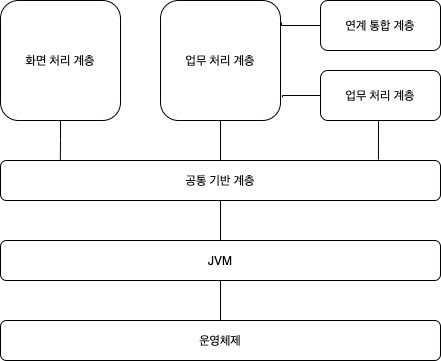

# 요구사항 확인

## 현행 시스템 파악

- 하위 시스템 파악
- 제공하는 기능 파악
- 다른 시스템과 주고받는 정보 파악
- 사용하는 기술 요소 파악
- 사용하는 소프트웨어/하드웨어 파악
- 네트워크 구성 파악

### why?

개발하고자 하는 시스템의 개발 범위 및 개발 방향성 설정에 도움

### 파악 절차

1. 시스템 구성/기능 현황 및 인터페이스 파악
2. 시스템 아키텍쳐 및 소프트웨어 파악
3. 하드웨어 및 네트워크 파악

### 시스템 구성/기능 현황 및 인터페이스 파악

#### 현행 시스템 구성 현황

- 현행 조직의 주요한 업무를, 처리하는 동안의 업무와 이를 지원하는 업무로 구분하여 기술한 것
- 각 업무에 속하는 단위 업무 정보 시스템들의 명칭, 주요 기능 명시

#### 현행 시스템 기능 현황

- 단위 업무 시스템이 현재 제공하고 있는 기능을 기술한 것
- 단위 업무 시스템에서 제공하는 기능들을 주요 기능과 하부 기능으로 구분하여 계층형으로 표시

#### 인터페이스 현황

- 단위 업무 시스템이 다른 단위 업무 시스템과 주고받는 데이터의 종류, 데이터 형식, 프로토콜, 연계유형, 주기 등을 명시

#### 인터페이스 분류

- 하드웨어 인터페이스
- 소프트웨어 인터페이스
- 사용자 인터페이스

### 시스템 아키텍쳐 및 소프트웨어 파악

#### 현행 시스템 아키텍쳐 구성도

- 현재 업무를 처리하기 위해 최상위 수준에서 계층별로 어떤 기술 요소들을 사용하고 있는지 표현한 것
- 현재 운영되는 시스템별로 구분, 서로 다른 경우에는 가장 핵심이 되는 업무 처리 시스템이 기준

#### 소프트웨어 구성도

- 현재 업무 처리를 위해 설치되어 있는 소프트웨어들의 제품명, 용도, 라이선스 적용 방식, 라이선스 수를 명시
- 시스템 구축 시 인프라 구축 비용 고려
- 하드웨어 비용 고려
- 주문형 소프트웨어 비용 고려
- 라이선스 적용 바익의 기준 파악
- 운영중인 사이트, 서버, 프로세서, 코어, 사용자 수 등 파악
- 라이선스 수량 파악

### 하드웨어 및 네트워크 파악

#### 하드웨어 구성도

- 최소의 비용으로 가용성을 높이는 이중화 기술이 적용되어 있는 지 명시
- 현행 업무 시스템들이 어느 서버에서 운용되고 있는 지 파악
- 이중화 기술은 현행 업무 시스템의 서비스 기간에 의해 필요성이 결정
- 이중화 기술은 현행 업무 시스템에 문제가 발생하였을 경우, 대응 정책에 의해 필요성이 결정
- 현행 업무 시스템에 이중화 기술이 적용되었다면 목표 시스템에서도 이중화 기술이 필요한 경우가 대부분
- 이중화 기술은 목표 시스템의 인프라 구축 난이도에 따라 비용이 증가할 가능성이 존재

#### 네트워크 구성도

- 서버의 위치 파악
- 서버 간 네트워크 연결 방식 파악
- 서버들의 물리적인 위치 관계 파악
- 조직 내 보안 취약성 분석 및 대응 파악
- 네트워크 장애 발생 추적 및 대응 파악

#### 저장장치

- DAS
  - 데이터저장장치를 호스트 버스 어댑터에 직접 연결
  - 구성이 용이
- NAS
  - 서버와 저장장치를 네트워크로 연결, 구성 설정 간편
  - 서버 간 스토리지 및 파일 공유가 용이
- SAN
  - DAS의 빠른 처리와 NAS의 스토리지 공유 장점을 합친 방식
  - 광케이블과 광채널 스위치를 통해 근거리 네트워크 환경 구성, 빠른 속도로 데이터 처리
  - 저장장치 연결로 스토리지 공유가 가능

### 가상화 기계

- 한 대의 서버를 많은 가상서버(가상화기계)로 분할
- 중앙처리장치, 메모리, 저장소 등을 논리적으로 분할

#### 가상화 기계 운영방법

- 하이퍼바이저형
  - 하이퍼바이저: 하드웨어를 가상화 하면서 하드웨어와 각각의 가상 시스템을 감시, 중간 관리자 역할을 하는 것
  - 하드웨어 상에 운영체제를 설치하기 전에 하이퍼바이저 설치, 그 위에 여러 개의 운영체제 설치
  - 중심이 되는 운영체제를 호스트 운영체제, 나머지를 게스트 운영체제 혹은 가상화기계라고 함
  - 게스트 운영체제의 종류에 대한 제약, 하드웨어 제약 없음, 임의의 VM에서 오류 발생해도 다른 VM에 영향을 주지 않음
  - VM들은 독자적으로 응용프로그램 설치/운영
- 호스트 하이퍼바이저형
  - 운영체제 위에 하이퍼바이저를 일반 응용프로그램처럼 설치, 그 위에 가상화 기계를 설치하여 운영
- 컨테이너형
  - 하나의 운영체제만 존재
  - 컨테이너라는 프로그램이 여러 개의 가상화 기계가 있는 것처럼 논리적으로 운영
  - 컨테이너는 작아 서비스 시작시간 짧고, 복제/배포 용이
  - 호스트 운영체제 위에 응용 프로그램 이미지를 배포하기만 하면 됨

### 전자정부 프레임워크

- 효율적인 전자 정부 기반 시스템의 구축 및 운영을 지원
- 전자 정부의 서비스 품질 및 정보화 투자 효율 향상의 기반을 확보
- 전자 정부 서비스에 대한 접근성을 제공하기 위해 표준 프레임워크 기반으로 개발된 공통 컴포넌트 제공

#### 전자정부프레임워크 구조

- 공통 기반 계층: 실행 환경 서비스 간에 공통적으로 사용되는 기능 제공
- 화면 처리 계층: 업무처리-사용자 간 인터페이스를 담당, 사용자 화면 구성, 사용자 입력 정보 검증 등 지원
- 업무 처리 계층: 업무 로직을 담당하는 서비스, 업무 흐름 제어, 트랜잭션 관리, 에러 처리
- 데이터 처리 계층: 데이터에 대한 CRUD 기능 지원
- 연계 통합 계층: 타 시스템과의 연동 기능 지원

#### 전자정부프레임워크의 목표

- 기본넉이고 공통적인 부분에 대한 컴포넌트를 제시
- 각 기관의 모든 프로그램은 이 범위 안에서 운영되길 원함
- 효율성/확장성을 갖도록 함

#### 전자정부프레임워크의 장점

- 중복 예산 절감
- 사업자 종속성 해소
- 무상 제공, 비용 경쟁력 향상
- 상호 운용성 향상
- 유지보수 용이

## 요구사항 정의

### 요구공학

> 시스템 요구샇아 문서를 생성, 검증, 관리하기 위한 활동들의 집합

#### 요구사항 개발 프로세스

> 도출 -> 분석 -> 명세 -> 확인

- 요구사항 도출
  - 해결해야 할 문제를 이해하는 첫번째 단계
  - 요구사항 출저 파악
  - 요구사항 수집방법 파악
  - 이해관계자 식별, 개발팀/고객 관계 생성
- 요구사항 분석
  - 요구사항 타당성 조사
  - 요구사항 간 상충되는 내용 해결
  - 소프트웨어 범위 파악
  - 개발비용/일정에 대한 제약 설정
  - 소프트웨어가 다른 환경과 어떻게 상호작용하는 지 이해
  - 요구사항 최적화하여 정확히 분석, 문서화
- 요구사항 명세
  - 요구사항 체계적으로 검토, 승인될 수 있는 문서 작성
  - 고객도 이해할 수 있을 정도로 쉽게 작성

#### 요구사항 명세기법

- 정형 명세기법
  - 수학적인 표기법으로 서술
  - 정확한 표현
  - 도구 사용 필수적
  - 명세서 간결, 명세-구현 일치
  - 수학적인 이해 필요
  - VDM, Z, CSP, CSS ...
- 비정형 명세기법

  - 자연어 기반 서술
  - 일반적, 친숙, 명세서로는 바람직하지 않다
  - 상태/기능/객체 중심 서술
  - 이해 용이, 의사 전달 방법 다양
  - 불충분, 모호성
  - FSM, Decision Table, E-R, SADT

- 요구사항 명세서 작성 시 고려사항
  - 쉽게 이해할 수 있게 작성
  - 모두 동의한 내용 작성
  - 모든 기능/모든 제약조건 기술
  - 품질 측정/검증/인수 테스트 기준 기술
  - 우선순위에 따른 중요도 기술
  - 요구사항 식별자 사용
- 요구사항 명세서 작성 원칙
  - 명확성
  - 완전성
  - 검증 가능성
  - 일관성
  - 수정 용이성
  - 추적 가능성
  - 개발 후 이용성

#### 요구사항 확인

- 분석가가 요구사항을 이해했는지 확인 필요
- 요구사항 명세서가 표준에 적합하고, 이해 가능한 지 확인
- 요구사항 명세서가 일관성 있고 완전한 지 검증
- 쉽게 작서되어있는지 확인
- 요구사항 관리 도구를 이용하여 요구사항 정이 명세서를 형상관리
- 실제로 적용 전에 문제를 파악하기 위한 여러 형태의 검증 수행

#### 요구사항 도출 기법

- 사용자 그룹 인터뷰
- 이해관계자 설문 조사
- 문헌 조사
- 프로토타이핑
- 스토리텔링
- 분석과 중재 기술
- 관찰과 모델 작성 기술

### 구조적 분석

#### 구조적 분석의 원리

- 추상화 원칙
  - 특정 대상의 실체로부터 분리된 개념/관점으로 대상을 간소하게 표현
  - 실체를 둘러싼 세부적인 것에 의한 제약을 받지 않고 문제 해결을 고려할 수 있음
- 정형화 원칙
  - 특정 대상을 수학적 알고리즘과 같이 연구할 수 있도록 하여 생각/명령을 자동화 시킬 수 있는 근거 제공
- 분할 정복 개념
  - 규모가 큰 시스템을 좀 더 작은 서브 시스템으로 나누어 쉽게 이해한다는 개념
- 계층적 구조의 개념
  - 여러개의 모듈로 나누어진 것들을 어떻게 배치하는 것이 좋을 것인가에 대한 문제
  - 모듈 상호 연관 관계 및 구조에 대한 이해도 향상에 크게 도움

#### 구조적 분석의 특징

- 그림 중심의 도형/도표로 분류
- 시스템 분석 시 사용자 참여 기회를 확대
- 시스템 개발의 모든 단계에서 필요한 명세서 작성이 가능
- 분석의 중복성을 배제하고 하향식으로 분석

#### 구조적 분석의 도구

- 자료 흐름도(DFD)
  - 구성요소들 사이에 자료/정보가 어떻게 흐르고 있는가 그림으로 도식한 다이어그램
  - 분석 단계에서 가장 첫번째로 작성
  - 분석의 핵심적인 구조, 3단계로 계츠화하여 세분되는 과정을 거쳐 산출됨
- 자료사전(DD)
  - 시스템과 관련된 모든 자료의 명세/자료 속성을 파악할 수 있도록 정리/조직화한 도구
- 소단위명세서(Mini-spec)
  - 내부적인 처리가 아닌 처리에 영향을 미치는 조건만을 프로그램 설계 언어로 간단하게 기술
