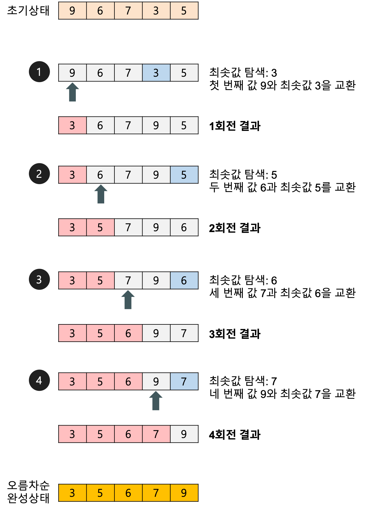
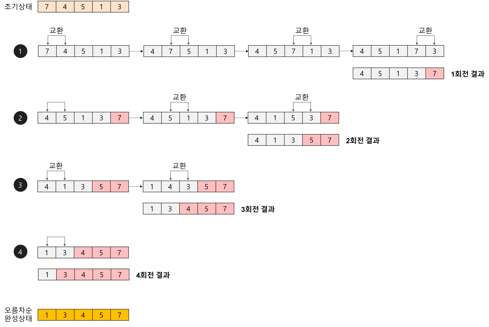
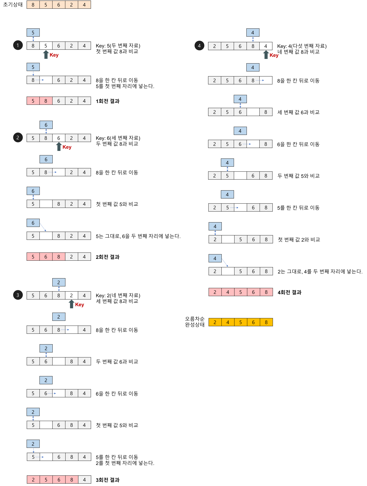
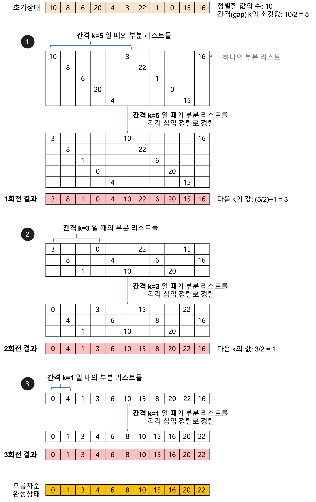
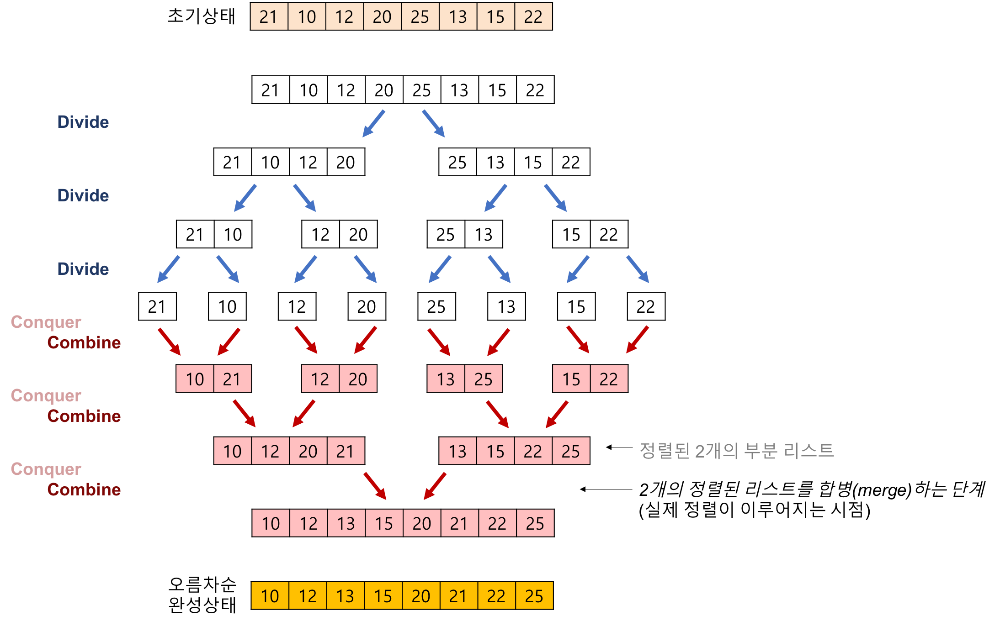

# 소프트웨어 설계

## 프레임워크 적용 기대효과

- 개발 용이
- 품질 보증
- 변경 용이
- 유지보수 용이
- 재사용성 향상
- 표준화율 향상
- 상호 운용성 향상

## 미들웨어

- 운영체제-소프트웨어 사이: 소프웨어에 운영체제 제공 서비스 추가/확장 제공
- 클라-서버 사이: 클라 서버 통신 담당

### 미들웨어 종류

- DBMS
- RPC
- MOM: 비동기형 메시지 전달
- TP-Monitor: 트랜잭션 감시
- ORB: 객체지향, 코바 표준 스펙 구현
- WAS: 웹 환경 구현 미들웨어

## 애자일 방법론

### 원칙

1. 소통
2. 협력
3. 적응
4. 지속
5. 가치전달
6. 피드백

### 5가지 가치

1. 의사소통
2. 용기
3. 피드백
4. 단순함
5. 존경

- XP : 애자일 기반으로 개발

## COCOMO

- 유기형 (Organic)
- 준분리형 (Semi-Detached)
- 내재형 (Embedded)

## Putnam

- 시간에 따른 함수 (Rayleigh-Norden) 곡선
- SLIM : Putnam 기반 자동화 추정 도구

## 형상 관리

- 버전관리

### 절차

1. 형상 식별
2. 변경 제어
3. 형상 상태 보고
4. 형상 감사

## 생명주기 모형

- 폭포수 모형: 각 단계 명확, 이전단계로 되돌릴 수 없음
- 나선형 모형: 계획수립->위험분석(이게중요)->개발/검증->고객평가 반복

## CMM

- 소프트웨어 개발/유지보수에 대한 프로세스 개선과 능력 향상을 위한 프레임워크

### CMM의 단계

1. 초기단계
2. 반복단계
3. 정의단계
4. 관리단계
5. 최적단계

### CMM의 평가기준 레벨 (낮을수록 위험)

1. 혼돈적 관리
2. 경험적 관리
3. 정성적 관리
4. 정량적 관리
5. 최적화 관리

## DFD

- 정보 흐름 도식화
- 분석 단계 가장 첫번째로 작성, 3단계 계층화
- 한 페이지 단위 작성
- 단계마다 6~7 버블 적당
- 페이지 당 버블 12개 이내
- 페이지 내 단계는 2~3단계 이내

### DFD 표기법

- 사각형: 외부 입출력
- 타원: 처리과정
- 화살표: 자료 흐름
- 선 두개: 자료 저장소

## DD(자료사전) 표기법

- 자료정의: =
- 자료연결: +
- 자료선택: [ | ]
- 자료반복: {}
- 자료생략: ()
- 자료설명: \*\*

## CASE

- 소프트웨어 개발 전체/일부 자동화 도구/방법론
- 표준화된 개발 환경 구축, 문서 자동화 제공
- 모든 분야에 적용
- 작업자 간 커뮤니케이션 증대
- CASE 툴은 분석가 지원 필요
- 수정 용이 정확
- 개발 기간 단축
- 유지보수 간편
- 생산성/재사용성 높아짐
- 그래픽 지원
- 자동화 검사
- CASE툴 간 호환성 없음
- 언어번역 지원 X
- SADT: SoftTech사, 요구분석/설계분석/설계 명세서 동시 표현
- PSL/PSA: 미시간 대학
- SREM: TRW, 미 국방성, 도형 표기법 R-Net, RSL, REVS

### 분류

- 상위 CASE: 요구분석/설계 지원
- 하위 CASE: 코드 작성, 검사 지원
- 통합 CASE: 전 과정 지원

## UI 설계 원칙

- 직관성
- 유효성
- 학습성
- 유연성

## 결합도와 응집도

- 좋은 모듈: 결합도 작게 응집도 크게

### 결합도 낮은 순 (자스제외공내)

1. 자료: 파라미터를 통해 상호작용
2. 스템프: 같은 레코드 부분적 공유, 모듈 간 인터페이스로 객체/자료구조 전달
3. 제어: 파라미터로 제어요소 전달(ex. sort(1), sort(2))
4. 외부: 외부 변수 공유
5. 공통: 전역 벼누 참조, 상호작용
6. 내용: 모듈이 다른 모듈 내부 기능/자료 참조

### 응집도 낮은 순 (우논시절통순기)

1. 우연적: 기능 간 연관성 없음
2. 논리적: 기능이 같은 범주끼리 묶임
3. 시간적: 수행 시기가 같은 것끼리 묶임
4. 절차적: 수행 시기가 순위가 이는 기능끼리 묶임
5. 통신적: 작업 대상이 가튼 것끼리 묶임
6. 순차적: 이전 명령으로부터 나온 출력을 다음 명령이 사용
7. 기능적: 모듈 내부가 하나의 단일 기능, 프로그램 내장 라이브러리

# 소프트웨어 개발

## 트리

- 단말노드: 자식 없음
- 노드차수: 자식 개수
- 트리차수: 노드차주 중 가장 큰 값
- 노드크기: 자신 + 자식 노드 수
- 노드깊이: 루트-본인 간선 수 (level 3에 있는 노드의 깊이는 2)

### 트리 순회 (근노드 위치에 따라 전/중/후)

- 전위(pre): 근노드->좌측->우측
- 중위(in): 좌측->근노드->우측
- 후위(post): 좌측->우측->근노드

## 폴리쉬 표기

- 전위: +AB
- 중위: A+B
- 후위: AB+

### 중위식->전위식

- 연산 순위가 빠른 연산부터 전위식 변경, 변경한 걸 하나의 대상으로 생각해서 계속 진행
- ex) `A=(B-C)*D+E -> =A+*-BCDE`
- 역(전->중) 변환: +AB 형태로 된 곳을 찾아 중위식으로 변경, 하나의 대상으로 생각해서 계속 진행`

## 중위식->후위식

- 연산 순위가 빠른 연산부터 후위식 변경, 변경한 걸 하나의 대상으로 생각해서 계속 진행
- ex) `A=(B-C)*D+E -> ABC-D*E+=`
- 역(후->중): AB+ 형태로 된 곳을 찾아 중위식으로 변경, 하나의 대상으로 생각해서 계속 진행

## 정렬

### 선택정렬

### 버블정렬

### 삽입정렬

### 쉘정렬

간격 조정을 통해 삽입 정렬 개선
10개의 자료에서 간격이 5라면 1번째 자료와 6번째 자료 비교

### 힙정렬

이진트리 만들어서 정렬  
$k=\frac{n}{2}$(k: 시작하위노드그룹, n: 전체자료수)

### 이진병합정렬

## 소프트웨어 패키징 시 고려사항

- 암호화 및 보안 고려
- 다양한 기종 연동 고려
- 복잡성/비효율성 문제 고려
- 적합한 암호화 알고리즘 적용
- 지속적인 배포 고려

### 패키징 도구 구성 요소

- 암호화
- 키관리
- 암호화 파일 생성
- 식별기술
- 저작권 표현
- 정책 관리
- 크랙 방지
- 인증

## 단위 테스트

### 화이트박스 테스트

- 소스 코드 모든 문장 한번 이상 수행
- 기초경로테스트, 루프테스트, 데이터흐름테스트, 조건테스트
- (대충 내부 로직 거쳐가는 종류의 테스트들)

### 블랙박스 테스트

- 요구사항 명세 보고, 프로그램 동작만으로 오류 찾음
- 동등분할, 경계값테스트, 오류예측, 원인결과그래프, 비교테스트

## 통합테스트

- 하향식: 메인부터 하위모듈로 통합하며 테스트, 하위더미모듈: 스터브
- 상향식: 하위부터 메인, 상위더미모듈: 드라이버, 모듈집합: 클러스터

## 시스템 테스트

- 알파: 제한된 환경에서 개발자가 지켜보며 사용자들이 테스트
- 베타: 뿌려서 사용자가 오류 발생시 개발자에게 통보

## 테스트 도구

### 정적 분석 지원도구

- pmd
- valgrind
- Find Bug
- checkstyle
- cppcheck
- corbetura
- Coverity
- IBM Rational Software, PolySpace

## EAI

서로 다른 플랫폼/응용프로그램 간 연동 솔루션

- Point-to-Point: 중간에 미들웨어 없이 직접
- Hub & Spoke: 허브를 통해 데이터 전송하는 중앙 집중적 방식
- Message Bus(ESB): 애플리케이션 사이에 버스로 처리, 뛰어난 확장성, 대용량 처리
- Hybrid: 그룹내에선 허브, 그룹 간에는 버스. 표준 통합 기술, 병목현상 최소화, 필요시 한가지 방식 가능

## 인터페이스 구현 검증 도구

- xUnit
- STAF
- FitNesse
- NTAF
- Selenium
- watir

# 데이터베이스

## 3단계 스키마

- 외부 스키마: 조직의 일부분을 정의
- 개념 스키마: DB구조 논리적 정의, 트랜잭션 모델링, 접근권한/무결성규칙/보안정책 포함
- 내부 스키마: 물리적 저장 장치의 입장, 레코드형식 정의, 표현방법, 물리적 순서

## 질의어

- DDL: 테이블 제어
- DML: 데이터 제어 (SUID)
- DCL: 보안/무결성/회복

## 모델링

- 개념 모델링: 개념스키마 모델링, 트랜잭션 모델링, 논리 데이터 모델의 기초, ERD 설계
- 논리 모델링: 논리적 DB 구조로 매핑, 스키마 및 트랜잭션 인터페이스 설계, 정규화
- 물리 모델링: 레코드 분석/설계, 저장 레코드들 클러스터링, 접근 경로 설계, DBMS 특성 고려, 반정규화

## ERD 표기법

- 개체: 사각형
- 속성: 동그라미
- 관계: 마름모

## 함수 종속

### 추론규칙

- 반사: A에 B가 포함되거나 같으면 A->B
- 첨가: A->B, AC->BC
- 이행: A->B & B->C, A->C
- 분해: A->BC, A->B | A->C
- 결합: A->B & A->C, A->BC

## 관계대수

- 일반집합연산자: 합집합, 교집합, 차집합, 곱집합
- 순수관계연산자: 셀렉션, 프로젝션, 조인, 디비전

## 정규화

- 1차: 도메인이 원자값만 갖음
- 2차: 부분함수종속 제거
- 3차: 이행적함수종속 제거
- 보이스코드: 결정자가 후보키가 아닌 함수 종속 제거
- 4차: 다중치 종속 제거
- 5차: 후보키를 통하지 않은 조인 종속 제거

## 로킹

- 하나의 트랜잭션에 사용하는 데이터를 다른 트랜잭션이 접근하지 못하도록 잠금

### 로킹 단위

로크 단위가 크면

- 로크의 수: 작아짐
- 병행 제어 기법: 단순
- 병행성 수전: 낮아짐
- 오버헤드: 감소

# 프로그래밍 언어 활용

## 객체지향 분석 방법론 종류

- 람바우(객동기): 객체-동적-기능 모형으로 분리 접근
- Booch: 미시적/거지석 개발 프로세스로 접근
- Coad-Yourdon: E-R 다이어그램 사용하여 객체 행위 모델링
- Jacobson: 사용자가 제품/시스템과 어떻게 상호작용하는지 서술한 시나리오
- Wirfs-Brock: 분석/설계 뚜렷한 구분 없음, 고객명세 평가로 시작, 설계로 끝나는 연속적 프로세스

## UML 다이어그램 분류

- 정적(구조): 클래스, 객체, 패키지, 컴포넌트, 복합구조, 배치
- 동적(행위): 유스케이스, 상태, 활동, 시퀀스, 통신, 상호작용, 타이밍

## GoF 디자인패턴

- 생성, 구조, 행위 3가지 분류의 디자인 패턴

## 프로세스 스케쥴링

- 비선점: 현재 실행 프로세스 중단 불가능
- 선점: 현재 실행 프로세스 중단 가능

- FIFO: 비선점, 입력된 순
- SJF: 비선점, 작업 끝나기까지 실행 시간 추정치가 가장 작은 작업 먼저 실행
- HRN: 비선점, 우선순위($우선순위=\frac{대기시간+서비스시간}{서비스시간}$)가 큰 작업부터 배치
- RR: 선점형, FIFO와 비슷한데 시간할당량 안에 안 끝나면 남은 작업은 뒤로 미룸
- SRT: 선점형, 틱마다 남은 실행시간 추정치가 가장 작은 프로세스 먼저 실행

## 페이징(교체전략)

- FIFO: 가장 오래 있던 페이지와 교체
- LRU: 가장 오랫동안 사용하지 않은 페이지와 교체
- LFU: 참조 횟수 가장 적은 페이지와 교체
- NUR: 최근에 호출도 사용도 하지 않은 페이지 교체

# 정보시스템구축관리

## OSI 7계층

1. 물리(P)
2. 데이터링크(D)
3. 네트워크(N)
4. 전송(T)
5. 세션(S)
6. 표현(P)
7. 응용(A)

## 네트워크 보안 기술

- SSL: 클라이언트와 서버 간 키 교환 방법 제공, 세션계층
- IPSec: ip 패킷의 보안 프로토콜로 패킷을 제거하거나 삽입 불가능하게 하는 보안기술, 네트워크 계층
- S-HTTP: 기존 HTTP에 인증, 기밀성, 무결성, 부인방지 기능 등 확장
- S/MIME: RSADSI 기술을 기반으로 개발된 이메일 보안기술

## 인터페이스 보안

- IPSec, S-HTTP, SSL

## DRM(디지털 저작권 관리) 기술요소

- 암호화
- 암호화 파일 생성
- 키관리
- 식별기술
- 저작권표현
- 정책관리
- 크랙방지
- 인터페이스
- 이벤트보고
- 사용권한
